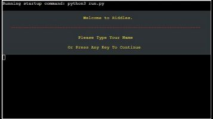
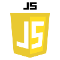
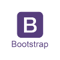
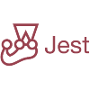

  

<h1 align="center">
  ⚡  About me  ⚡
<h1>

 

  I’m currently studying Full Stack Software Development at Code Institute

 

  
  
  

 

[_Code Institute_](https://codeinstitute.net/ie/).

 

<h1 align="center">
  My Own Built projects
</h1>

 

| Repository     | Picture      |   Live Deployment  | Descriptions |
| :--------:     |    :----------:  |  :--------: | :-------------: |
|[_Riddles_](https://github.com/A-Croshaw/Riddles)||[_Click Here_](https://ac-riddles.herokuapp.com/)|Python app linking to google sheets|
|[_Hi-Low-Game_](https://github.com/A-Croshaw/hi-low-game)||[_Click Here_](https://a-croshaw.github.io/hi-low-game/)| JavaScript, HTML and CSS. Based Game |
|[_Cosbranok_](https://github.com/A-Croshaw/cosbranok)||[_Click Here_](https://a-croshaw.github.io/cosbranok/)|HTML and CSS based website|

  

 

<h1 align="center">
  Languages and technologies:
</h1>

 

  
  
  
  
  
  
  
  
  
  
  
  

 

<h1 align="center">
  GitHub Stats:
</h1>

 

  
   

 

  

 

 

<!--
Here are some ideas to get you started:

- 🔭 I’m currently working on ...

- 👯 I’m looking to collaborate on ...
- 🤔 I’m looking for help with ...
- 💬 Ask me about ...
- 📫 How to reach me: ...
- 😄 Pronouns: ...
- ⚡ Fun fact: ...
- 📫 

-->

