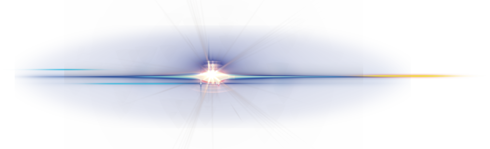
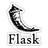

  

# ⚡  About me  ⚡

 

I’m currently studying Full Stack Software Development at [Code Institute](https://codeinstitute.net/ie/).

 

  

 

# Languages and technologies:

 

  
  
  
  

 

  
  

 

    

 

  

 

# GitHub Stats:

 

  
   

 

  

 

 

<!--
Here are some ideas to get you started:

- 🔭 I’m currently working on ...

- 👯 I’m looking to collaborate on ...
- 🤔 I’m looking for help with ...
- 💬 Ask me about ...
- 📫 How to reach me: ...
- 😄 Pronouns: ...
- ⚡ Fun fact: ...
- 📫 

-->

